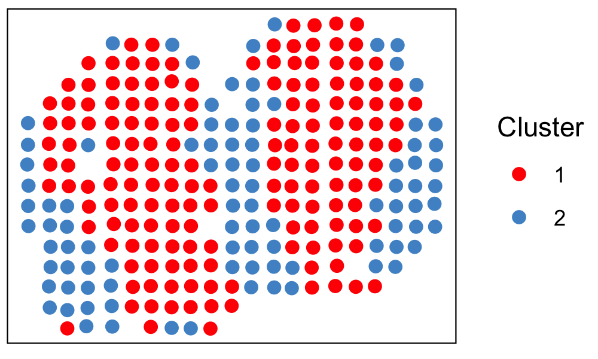

# BayesCafe

An Interpretable <ins>Bayes</ins>ian <ins>c</ins>lustering <ins>a</ins>pproach with <ins>f</ins>eature s<ins>e</ins>lection for analyzing spatially resolved transcriptomics data

## Introduction

**BayesCafe** is a Bayesian hierarchical model developed to analyze spatially resolved transcriptomics (SRT) data. It directly models the molecular profile of SRT
data via a zero-inflated negative binomial (ZINB) model, and utilizes a feature selection
approach that offers low-dimensional representations of the SRT data in terms of a list
of discriminating genes. BayesCafe employs an Markov random field prior to integrate the geospatial profile of SRT data to improve clustering accuracy. 


**BayesCafe** was developed and tested under `R 4.2.2`. The following R packages are required to run the model

- Rcpp
- RcppArmadillo
- RcppDist
- mclust
- SingleCellExperiment
- scuttle
- scran

## Run BOOST-GP on demo data

The following section will guide to run a exemplary data using **BayesCafe**.

### Load BayesCafe and demo data
```r
source("R/BayesCafe.R")
load("data/demo_Data.Rdata")
```

**BayesCafe** includes two objects:

1. `count data`: a count matrix with each row representing one spatial location, 
and each column representing one gene.

2. `location data`: a location matrix specifying the coordinates of each spatial location.

### Data preprocessing
Before running the model, we need to perform data preprocessing and generate required inputs for running the model, the essential inputs are:

- count: a matrix of raw SRT count data, each row represents a spatial location 
and each column represents a gene.
- loc: a matrix  with two columns representing the x and y coordinates of the spatial location.
- cutoff_sample: a number indicating that spatial locations are kept with at least this number of total counts across all genes. Default is 100.
- cutoff_feature: a number indicating that genes are kept with at least this percent of spatial locations with non-zero counts. Default is 0.1.
- cutoff_max: a number indicating that genes are kept with at least this number of maximum counts across all spatial locations. Default is 0.
- size.factor: a character string specifying method to calculate sample-specific size factor, must be one of `tss`, `q75`, `rle`, or `tmm`. Default is `tss`.
- platform: a character string specifying the SRT technology in order to construct neighbor structure, must be one of `ST`, `Visium`, or `other` (for any technologies other than `ST` and `10x Visium`).
- findHVG: a logical indicating whether to find the highly variable genes. Default is `FALSE`.
- n.HVGs: a number indicating number of highly variable genes to be detected. Default is 2000.

```r
result <- dataPreprocess(
  count = count, 
  loc = loc, 
  cutoff_sample = 100, 
  cutoff_feature = 0.1, 
  cutoff_max = 0, 
  size.factor = "tss", 
  platform = "ST",
  findHVG = FALSE, 
  n.HVGs=2000)

count <- result$count
loc <- result$loc
s <- result$s
P <- result$P
```

## Run the model
We run the model using function `bayes_cafe`, where `K` is the specified number of clusters.

```r
res <- bayes_cafe(
  count = count, 
  loc = loc, 
  K = 2, 
  s = s, 
  P = P)
```

### Identifying the discriminating genes
The main purpose of **BayesCafe** is to identify discriminating genes and cluster spatial locations.
To obtain discriminating genes, we can check their marginal posterior probabilities
of inclusion (PPI). Then, the discriminating genes are identified
if their PPI values exceed a given threshold $c$, $c$ = 0.5, which is commonly referred to as the median model.

Alternatively, we can determine the threshold that controls for multiplicity, which ensures that the expected Bayesian false discovery rate (BFDR) is less than a
specified value (e.g. 0.05). 

```r

```


### Visualize the clustering results




